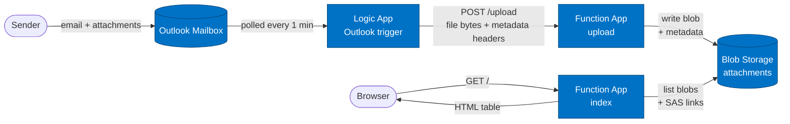

# Email-to-Website File Upload (Azure + Terraform)

When an email with attachments arrives at a designated mailbox, a Logic App
forwards each attachment to an Azure Function, which stores it in Blob Storage
and exposes a minimal web page listing the uploaded files along with the
sender (masked) and email subject.



## Features
- **Fully Terraform-managed Azure infrastructure** — single `main.tf` provisions everything.
- **Email metadata captured** — sender address, subject, and received timestamp are stored as blob metadata alongside each attachment.
- **Privacy-respecting display** — sender email addresses are masked on the web page (`j***n@e***e.com` style).
- **Short-lived SAS download links** — files are listed with one-hour user-delegation SAS URLs generated on the fly.
- **Managed Identity for storage access** — no connection strings or keys in code.
- **Interactive PowerShell deployment script** — guided menu with prereq checks, Terraform actions, browser-based connection authorization, and Function code publishing.
- **MIT licensed.**

## Components (all Terraform-managed)
- Resource Group
- Storage Account + `attachments` blob container
- Key Vault
- Application Insights (workspace-based)
- Linux Function App (Python 3.11, Consumption plan) with two HTTP functions:
  - `POST /upload` — receives a file body, stores it in blob with metadata
  - `GET /` — HTML listing of stored blobs with masked sender, subject, size, timestamp, and SAS download link
- Logic App workflow with Outlook (or Office 365) connector
- Outlook API Connection (managed via the `azapi` provider; requires one-time portal authorization)

## Prerequisites
- PowerShell (Windows)
- [Terraform](https://developer.hashicorp.com/terraform/install) >= 1.5
- [Azure CLI](https://learn.microsoft.com/cli/azure/install-azure-cli)
- [Azure Functions Core Tools v4](https://learn.microsoft.com/azure/azure-functions/functions-run-local) (`func`)
- Python 3.11
- An Azure subscription with quota for App Service / Function App in your chosen region
- An Outlook.com or Microsoft 365 mailbox to act as the trigger inbox

The deploy script can verify all of these for you (option **1**).

## Deploy

Everything is driven by `deploy.ps1` at the repo root.

1. **Create your inputs file** from the template and fill it in:
   ```powershell
   Copy-Item inputs.ps1.example inputs.ps1
   notepad inputs.ps1
   ```
   Required values:
   - `Azure_Tenant_Id` — your Azure AD tenant ID
   - `Azure_Subscription_Id` — target subscription
   - `Azure_Location` — region (e.g. `eastus2`)
   - `Name_Prefix` — short lowercase prefix for all resource names (≤8 chars, no dashes)
   - `Target_Email_Address` — the mailbox to monitor

   `inputs.ps1` is gitignored so your IDs never get committed.

2. **Run the deploy script:**
   ```powershell
   .\deploy.ps1
   ```

   It will load `inputs.ps1`, sign in to Azure, and present a menu:

   ```
   1) check prerequisites
   2) terraform init
   3) terraform plan
   4) terraform apply
   5) authorize Outlook API connection (opens browser)
   6) publish Function App Python code
   7) terraform destroy
   Q) quit
   ```

3. **Recommended first-run sequence:** `1 → 2 → 3 → 4 → 5 → 6`
   - **1** confirms all required tools are installed.
   - **2 → 3 → 4** initialize, plan, and apply the Terraform.
   - **5** opens the Azure portal to the Outlook API connection — click **Authorize**, sign in as the target mailbox owner, and **Save**. (This step cannot be automated; the Outlook connector requires interactive OAuth consent.)
   - **6** publishes the Python function code to the Function App.

## Test
1. Send an email with one or more attachments to the target address.
2. Within ~1 minute the Logic App's polling trigger fires.
3. Browse to the Function App URL (printed by `terraform output function_app_url`) — uploaded files appear in a table with **File**, **From** (masked), **Subject**, **Size**, and **Uploaded** columns. Each filename is a SAS download link.

## Tear down
From the deploy menu, choose **7) terraform destroy** and confirm. Terraform is configured with `prevent_deletion_if_contains_resources = false`, so the resource group will be removed even if Azure has lingering child resources.

## Architecture notes
- **Auth flow #1 — Function ↔ Storage:** the Function App uses a System-Assigned Managed Identity with the `Storage Blob Data Contributor` role on the storage account. No connection strings or account keys appear in code.
- **Auth flow #2 — Logic App ↔ Outlook:** the Outlook connector uses delegated OAuth on behalf of the mailbox owner. Terraform provisions the connection resource (via the `azapi` provider to work around a bug in `azurerm_api_connection`), but the OAuth grant must be performed interactively in the Azure portal once per deployment.
- **Function routing:** `host.json` sets `routePrefix = ""`, so the index function serves at `/` and the upload function at `/upload` (instead of the default `/api/...`).
- **Blob naming:** uploaded blobs are prefixed with `YYYYMMDDTHHMMSS-` to avoid collisions when the same filename is sent multiple times. The original filename is preserved in blob metadata and shown on the listing page.
- **Email metadata:** `from_address`, `subject`, `received`, and `original_name` are stored as blob metadata. Header values are sanitized to ASCII before being applied (Azure blob metadata does not allow non-ASCII characters).
- **Email masking:** the index function masks any email address it displays, replacing the middle of the local part and domain with `***`. The full address is still stored in blob metadata for forensics — only the rendered HTML is masked.

## Project layout
```
file-upload/
├── LICENSE                  # MIT
├── README.md
├── deploy.ps1               # Interactive deployment menu
├── inputs.ps1.example       # Template for project inputs
├── inputs.ps1               # (gitignored) your real inputs
├── .gitignore
├── infra/
│   ├── main.tf              # All Azure resources
│   └── variables.tf
└── function/
    ├── host.json
    ├── requirements.txt
    ├── upload/              # POST /upload  → writes blob + metadata
    │   ├── function.json
    │   └── __init__.py
    └── index/               # GET /         → HTML listing with SAS links
        ├── function.json
        └── __init__.py
```

## License
MIT — see [LICENSE](LICENSE).
